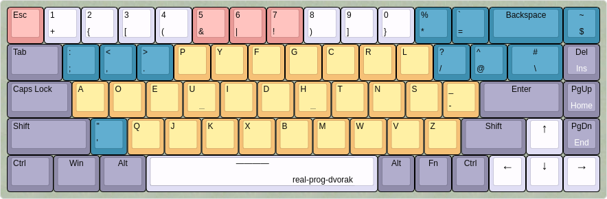

# real-prog-dvorak

This is a modified version of the 'Programmers Dvorak'.

## Keyboard Layout

I use Vim all the time, and I am using a 68 keys keyboard.



The keyboard layout is genereated by
[Keyboard Layout Editor](http://www.keyboard-layout-editor.com/#/gists/dbb92bdd7c9b13380194a4e436c2265f).
You may use the above link to create your fork.

Use this keyboard layout (Ubuntu 20.04/22.04):
Edit the X11 keyboard symbols, for example I am changing the US Keyboard Layout:

```bash
sudoedit /usr/share/X11/xkb/symbols/us
```

Then, paste the following key code mappings into the file.

```
partial alphanumeric_keys
xkb_symbols "real-prog-dvorak" {

    name[Group1]= "English (Real Programmers Dvorak)";

    key <TLDE> { [       dollar,        asciitilde, dead_grave, dead_tilde      ] };

    key <AE01> { [          plus,       1               ]       };
    key <AE02> { [          braceleft,        2               ]       };
    key <AE03> { [          bracketleft,  3       ]       };
    key <AE04> { [          parenleft,  4               ]       };
    key <AE05> { [          ampersand,      5               ]       };
    key <AE06> { [          equal,  6, dead_circumflex, dead_circumflex ]   };
    key <AE07> { [          parenright, 7       ]       };
    key <AE08> { [          bracketright, 8       ]       };
    key <AE09> { [          braceright,       9,  dead_grave] };
    key <AE10> { [          asterisk,   0       ]       };
    key <AE11> { [ exclam,      percent ]       };
    key <AE12> { [ bar, grave,  dead_tilde] };

    key <AD01> { [  semicolon,  colon, dead_acute, dead_diaeresis       ] };
    key <AD02> { [      comma,  less,   dead_cedilla, dead_caron        ] };
    key <AD03> { [      period, greater, dead_abovedot, periodcentered  ] };
    key <AD04> { [          p,  P               ]       };
    key <AD05> { [          y,  Y               ]       };
    key <AD06> { [          f,  F               ]       };
    key <AD07> { [          g,  G               ]       };
    key <AD08> { [          c,  C               ]       };
    key <AD09> { [          r,  R               ]       };
    key <AD10> { [          l,  L               ]       };
    key <AD11> { [      slash,  question        ]       };
    key <AD12> { [      at,     asciicircum             ]       };

    key <AC01> { [          a,  A               ]       };
    key <AC02> { [          o,  O               ]       };
    key <AC03> { [          e,  E               ]       };
    key <AC04> { [          u,  U               ]       };
    key <AC05> { [          i,  I               ]       };
    key <AC06> { [          d,  D               ]       };
    key <AC07> { [          h,  H               ]       };
    key <AC08> { [          t,  T               ]       };
    key <AC09> { [          n,  N               ]       };
    key <AC10> { [          s,  S               ]       };
    key <AC11> { [      minus,  underscore      ]       };

    key <AB01> { [   apostrophe,        quotedbl, dead_ogonek, dead_doubleacute ] };
    key <AB02> { [          q,  Q               ]       };
    key <AB03> { [          j,  J               ]       };
    key <AB04> { [          k,  K               ]       };
    key <AB05> { [          x,  X               ]       };
    key <AB06> { [          b,  B               ]       };
    key <AB07> { [          m,  M               ]       };
    key <AB08> { [          w,  W               ]       };
    key <AB09> { [          v,  V               ]       };
    key <AB10> { [          z,  Z               ]       };

    key <BKSL> { [  backslash,  numbersign             ]       };
};
```

Then add an entry for this:

```bash
sudoedit /usr/share/X11/xkb/rules/evdev.xml
```

Add this somewhere:
```xml
<variant>
  <configItem>
    <name>real-prog-dvorak</name>
    <description>English (Real Programmers Dvorak)</description>
  </configItem>
</variant>
```

Open keyboard settings, and add this layout, you may need to reboot or log out
your computer to get this work.

## Typing Tutorial

- [x] [real-prog-dvorak](https://pseudocc.github.io/real-prog-dvorak/)
